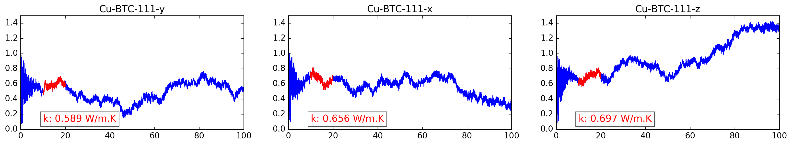
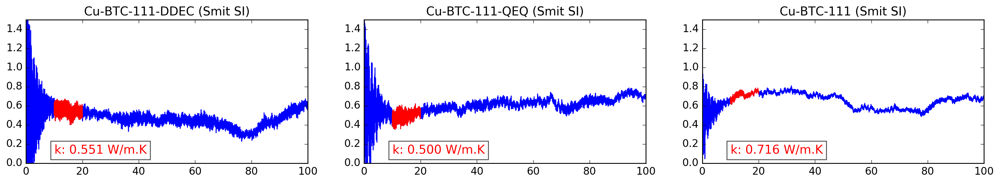
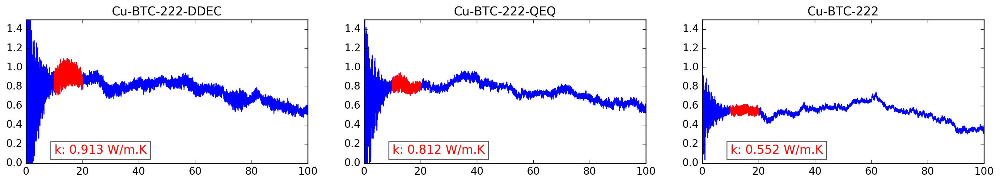
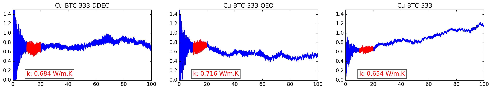
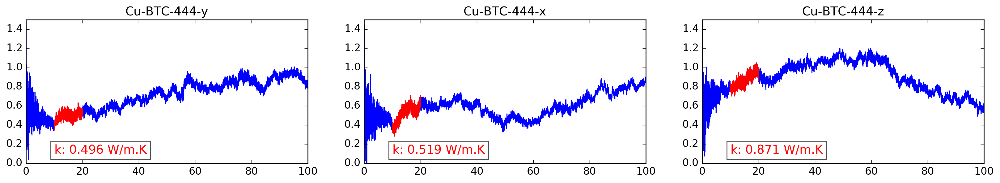

CuBTC
=====
Thermal flux autocorrelation functions for CuBTC (HKUST-1) with different charge assignments and packing coefficients. Simulations are performed at 298 K using *UFF4MOF* forcefield. The input files are generated using [lammps_interface](https://github.com/kbsezginel/lammps_interface) unless it is designated as *Smit SI* in which case they are taken from the supplementary information of the article by Berend Smit and co-workers. Here is the article:

[Force-Field Prediction of Materials Properties in Metal-Organic Frameworks](http://pubs.acs.org/doi/abs/10.1021/acs.jpclett.6b02532)

Packing coefficients are varied between 1x1x1 - 4x4x4. Different charge assignments were tried designated by *DDEC* and *QEQ*. More about the force field parameters and charges can be found [here](https://kbsezginel.github.io/tee_mof/irmof10). In some cases thermal flux in each direction are shown separately as *x*, *y*, and *z*. Often, the average thermal flux is reported since the structure is symmetric.

### 1x1x1

  

  

### 2x2x2

  

### 3x3x3

  

### 4x4x4

  

