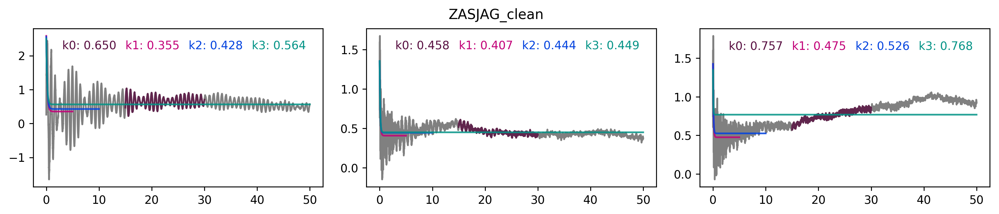
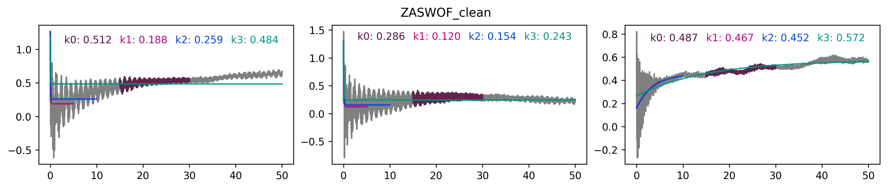
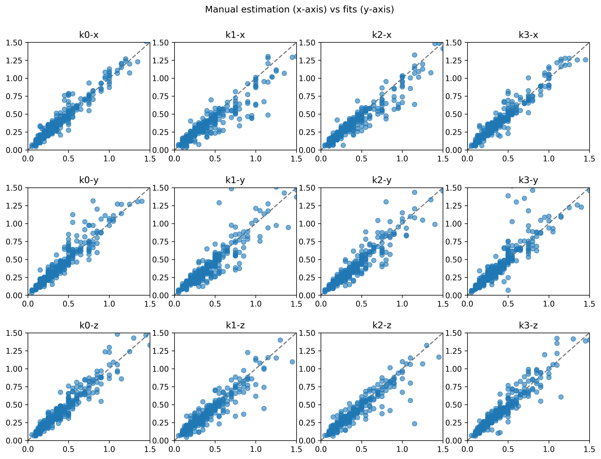
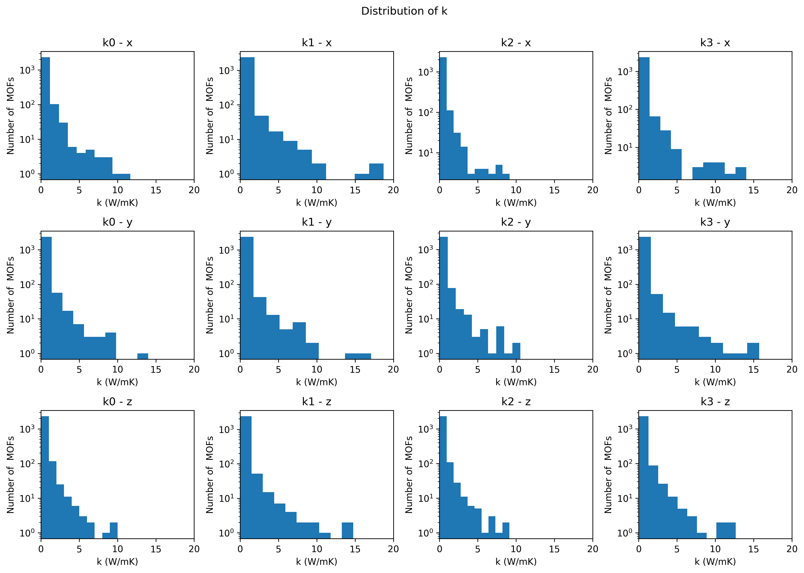
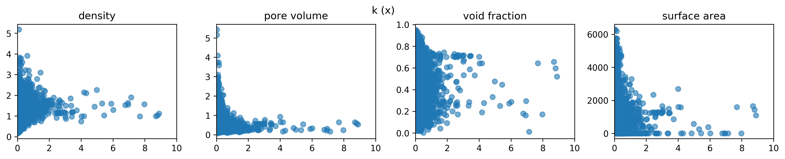
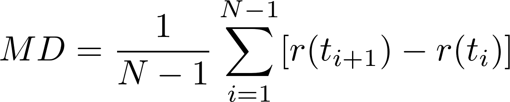
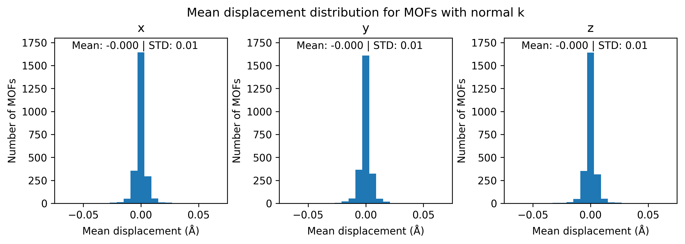
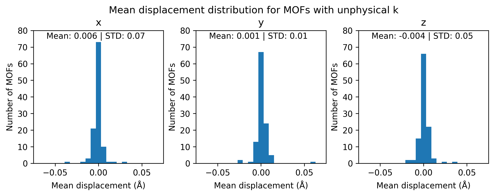

Automated Estimation of Thermal Conductivity
============================================

I have tried 3 following methods to estimate *k* automatically:
- k0: Linear fit between 15 - 30 ps (6000 - 12000 timesteps)
- k1: Exponential fit between 0 - 5 ps (0 - 2000 timesteps)
- k2: Exponential fit between 0 - 10 ps (0 - 2000 timesteps)
- k3: Exponential fit between 0 - 50 ps (0 - 2000 timesteps)

You can see in the plot below how these fits are done:

  

  

Comparison with Manual Estimation
---------------------------------

  

    
Click here for more

    <b>Manually read k values vs automatically calculated k values for each direction (x, y, z) and for the whole range (0 - 12 W/mK).</b>
    
  

    <b>Manually read k values vs automatically calculated k values for each direction (x, y, z) zoomed in (0 - 1.5 W/mK).</b>
    
  

  

Thermal Conductivity Distribution
----------------------------------

  

    
Click here for more

    
  

  

Thermal Conductivity vs MOF Properties
--------------------------------------

  

    
Click here for more

    
  

    This plot is for thermal conudctivity in x direction. Other directions show the same trends.
  

Displacement Analysis for MOFs with Unphysical Thermal Conductivities
---------------------------------------------------------------------

  

    
Click here for more

    I separated the MOFs that have a k estimation between 0 - 20 W/mK and the MOFs where k is not calculated
    or k is calculated out of this range. Then I calculated the mean displacement (MD) for one of the framework atoms
    for each MOF using the formula below:
    
  

    I mainly did this to see whether MOFs with unphysical k values have higher displacement
    that MOFs with normal k values. For some of the MOFs we saw that the framework was drifting which was causing
    unphysically high k values.

    Even though there is some difference between the displacements the difference is not much.
    More analysis is required.
    
  

    
  

    This plot is for thermal conudctivity in x direction. Other directions show the same trends.
  

