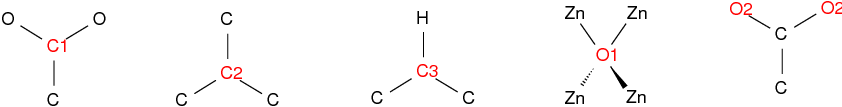

# Lammps force field tests
Tests are performed using Lammps files in supplementary information of [Smit and co-workers] and using [lammps_interface] Python library to generate Lammps files from cif files.

## Charges
Following charges are used in [Smit and co-workers].

|Atom Type|HKUST-1 (ddec)|HKUST-1 (qeq)|IRMOF-1 (ddec)|IRMOF-1 (qeq)|
|:--------|:-------------|:------------|:-------------|:------------|
|C_R      |1:        mix |3:        mix|1:         mix|4:        mix|
|Cu4+2    |2:     0.87890|2:    0.63081|              |             |
|H_       |3:     0.13538|4:    0.17744|2:     0.12660|5:    0.16514|
|O_2      |4:    -0.53193|1:   -0.47531|3:    -0.53938|3:   -0.46786|
|O_3_f    |              |             |4:    -1.03367|2:   -0.23162|
|Zn3f2    |              |             |5:     0.95676|1:    0.45797|

3 different carbon types were defined for both HKUST-1 and IRMOF-1 and 2 oxygen types were defined for IRMOF-1 as follows. Here *O1* refers to *O_3_f* and *O2* refers to *O_2* atom type in UFF4MOF. For carbon atoms same atom type (*C_R*) have been used, however, different charges were assigned.

  

The charges for different carbon atoms were defined as follows:

|Atom Type|HKUST-1 (ddec)|HKUST-1 (qeq)|IRMOF-1 (ddec)|IRMOF-1 (qeq)|
|:--------|:-------------|:------------|:-------------|:------------|
|C1       |       0.61036|      0.61648|       0.57679|      0.59404|
|C2       |      -0.09685|     -0.13435|      -0.10308|     -0.14130|
|C3       |      -0.02448|     -0.02435|      -0.01064|      0.02729|

----------------------------------------------------------------------------------
[Smit and co-workers]: http://pubs.acs.org/doi/abs/10.1021/acs.jpclett.6b02532
[lammps_interface]: https://github.com/peteboyd/lammps_interface
