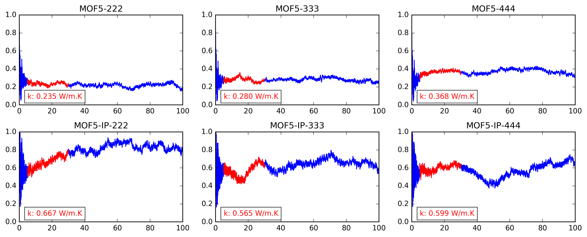

IRMOF-1 Interpenetration
======================
Thermal flux autocorrelation functions for interpenetrated and non-interpenetrated IRMOF-1 (MOF-5) with different packing coefficients. Simulations are performed at 298 K using *UFF4MOF* forcefield with no charges.

  

