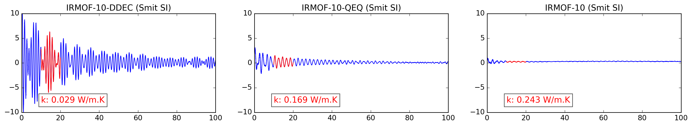

IRMOF-10
========
Thermal flux autocorrelation functions for IRMOF-10 with different charge assignments. Simulations are performed at 298 K using *UFF4MOF* forcefield. The input files for Lammps are taken from the supplementary information of the article by Berend Smit and co-workers. Here is the article:

[Force-Field Prediction of Materials Properties in Metal-Organic Frameworks](http://pubs.acs.org/doi/abs/10.1021/acs.jpclett.6b02532)

  

