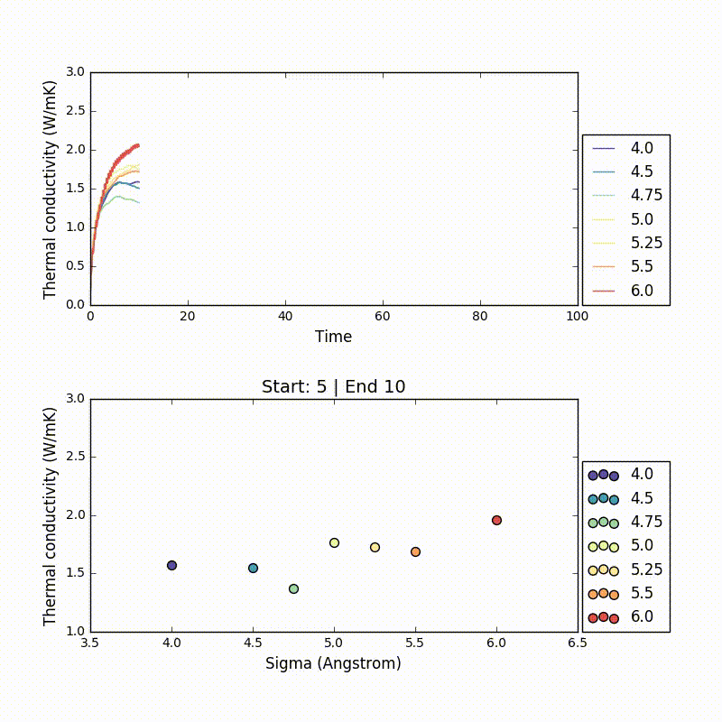

Estimating thermal conductivity
-------------------------------
Estimating a thermal conductivity (*k*) value from NVE simulations can be tricky.
After the autocorrelation function is calculated, *k* is estimated as the converging value.
However, if sampling is not enough the autocorrelation function might not converge in the given time frame.
As a result, it is not easy to estimate the *k* automatically without visual inspection.
Here is an animation showing the variability of *k* according to how it's estimated.

  

In the plot above the thermal conductivity autocorellation functions are showed and in the bottom plot a *k* is estimated by taking the average between *start* and *end* timesteps.
According to where the average is taken the trends in the plot change dramatically. 
