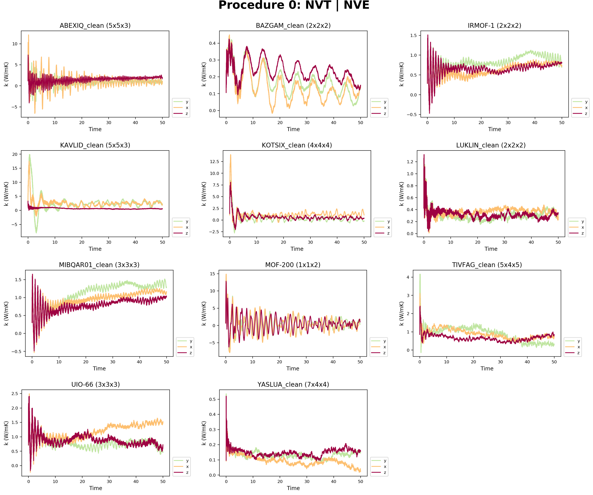
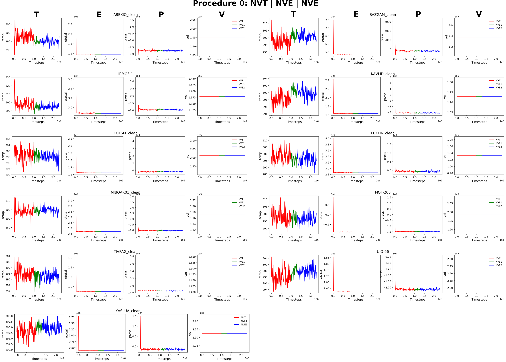

### Procedure 0 (NVT | NVE)

#### Thermal Conductivity

  

#### Thermodynamics

  

### Volume change

| MOF   |Thermal Conductivity|Volume Change|Time|
|:------|:------------------:|:-----------:|:--:|
|IRMOF-1|                    |             |    |
|NU-125 |                    |             |    |
|UIO-66 |                    |             |    |
