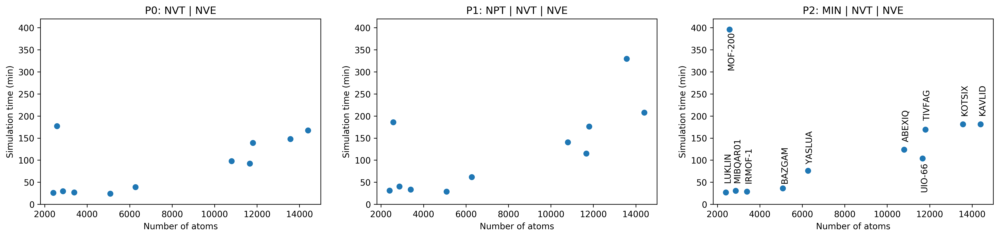
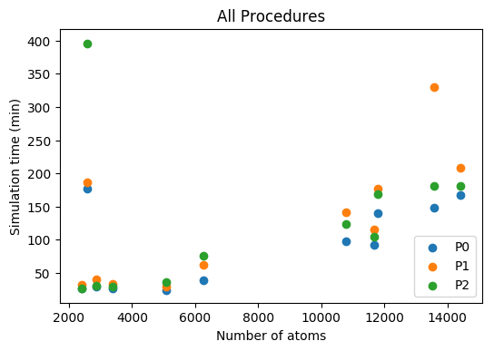
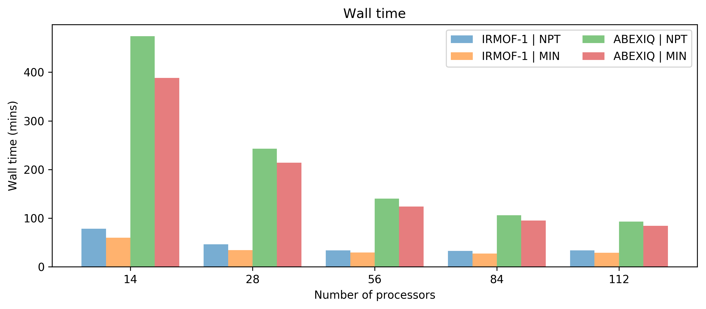
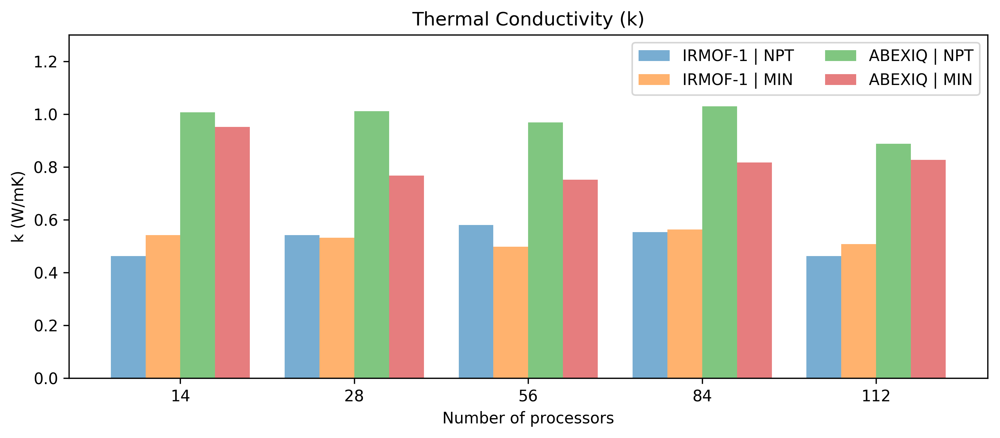
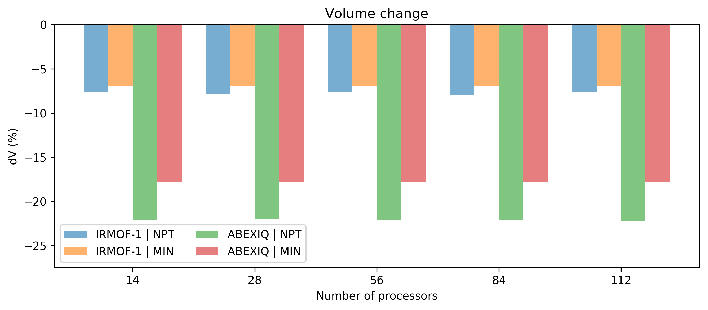

Thermal Conductivity
--------------------

  

| MOFs           |   k (P0) |     k (P1) |   k (P2) |
|:---------------|---------:|-----------:|---------:|
| ABEXIQ         | 0.798137 |  0.968289  | 0.751557 |
| MOF-200        | 0.280038 | -0.0900495 | 0.652325 |
| MIBQAR01_clean | 0.67421  |  0.568141  | 0.604212 |
| KOTSIX_clean   | 0.695291 |  0.657047  | 0.725224 |
| LUKLIN_clean   | 0.334687 |  0.325566  | 0.399432 |
| KAVLID_clean   | 1.97645  |  1.90198   | 1.79313  |
| UIO-66         | 0.868001 |  0.920516  | 0.91934  |
| TIVFAG_clean   | 1.05043  |  0.881849  | 1.02839  |
| BAZGAM_clean   | 0.259037 |  0.169085  | 0.263757 |
| YASLUA_clean   | 0.136772 |  0.303419  | 0.275082 |
| IRMOF-1        | 0.624206 |  0.579418  | 0.497078 |

Volume change
-------------

  

| MOFs           |   dV (%) - P0 |   dV (%) - P1 |   dV (%) - P2 |
|:---------------|--------------:|--------------:|--------------:|
| ABEXIQ         |             0 |    -22.1385   |    -17.8195   |
| MOF-200        |             0 |    -20.0282   |    -18.8755   |
| MIBQAR01_clean |             0 |     -8.41947  |     -7.5412   |
| KOTSIX_clean   |             0 |      0.961154 |     -2.49758  |
| LUKLIN_clean   |             0 |    -11.695    |      0.814653 |
| KAVLID_clean   |             0 |     -4.02588  |     -4.56214  |
| UIO-66         |             0 |     -5.67012  |     -5.43697  |
| TIVFAG_clean   |             0 |     -4.11291  |     -3.81107  |
| BAZGAM_clean   |             0 |     -2.75286  |      0.673155 |
| YASLUA_clean   |             0 |    -29.9351   |    -29.2759   |
| IRMOF-1        |             0 |     -7.66637  |     -6.99281  |

Wall time
---------

  

| MOFs           | N atoms | Time (mins)-P0 | Time (mins)-P1 | Time (mins)-P2 |
|:---------------|--------:|---------------:|---------------:|---------------:|
| ABEXIQ         |   10800 |        97.7167 |       140.7    |        123.767 |
| MOF-200        |    2576 |       177.167  |       185.983  |        395.767 |
| MIBQAR01_clean |    2862 |        29.5167 |        40.5333 |         30.75  |
| KOTSIX_clean   |   13568 |       147.933  |       329.667  |        181.183 |
| LUKLIN_clean   |    2400 |        26.0333 |        31.3667 |         27.05  |
| KAVLID_clean   |   14400 |       167.583  |       207.617  |        181.433 |
| UIO-66         |   11664 |        92.4667 |       114.95   |        104.117 |
| TIVFAG_clean   |   11800 |       139.367  |       176.45   |        169.283 |
| BAZGAM_clean   |    5088 |        24.1333 |        29.0167 |         36.35  |
| YASLUA_clean   |    6272 |        39.1833 |        61.6    |         76.05  |
| IRMOF-1        |    3392 |        27      |        33.4667 |         28.95  |

  

  

Heat flux autocorrelation
-------------------------
### Procedure 0 (NVT | NVE)

  

### Procedure 1 (NPT | NVT | NVE)

  

### Procedure 2 (MIN | NVT | NVE)

  

Computational Resource
----------------------
### Wall time

  

### Thermal conductivity

  

### Volume change

  

| MOF     | Procedure   |   Nodes |   PPN |Time (min)| k (W/mK) |    dV (%)  |
|:--------|:------------|--------:|------:|---------:|---------:|-----------:|
| IRMOF-1 | P1          |       2 |     7 |  78.1833 | 0.462116 |   -7.67816 |
| IRMOF-1 | P1          |       2 |    14 |  46.1667 | 0.541847 |   -7.855   |
| IRMOF-1 | P1          |       2 |    28 |  33.6833 | 0.579418 |   -7.66637 |
| IRMOF-1 | P1          |       3 |    28 |  32.4167 | 0.552733 |   -7.96882 |
| IRMOF-1 | P1          |       4 |    28 |  33.6833 | 0.462914 |   -7.62663 |
| IRMOF-1 | P2          |       2 |     7 |  60.0333 | 0.5411   |   -6.97435 |
| IRMOF-1 | P2          |       2 |    14 |  34.45   | 0.532054 |   -6.96926 |
| IRMOF-1 | P2          |       2 |    28 |  29.2833 | 0.497078 |   -6.99281 |
| IRMOF-1 | P2          |       3 |    28 |  27.0667 | 0.562708 |   -6.96839 |
| IRMOF-1 | P2          |       4 |    28 |  28.8833 | 0.507436 |   -6.97095 |
| ABEXIQ  | P1          |       2 |     7 | 474.217  | 1.00649  |  -22.08    |
| ABEXIQ  | P1          |       2 |    14 | 242.867  | 1.01105  |  -22.0426  |
| ABEXIQ  | P1          |       2 |    28 | 140.067  | 0.968289 |  -22.1385  |
| ABEXIQ  | P1          |       3 |    28 | 106.183  | 1.02969  |  -22.1161  |
| ABEXIQ  | P1          |       4 |    28 |  92.8333 | 0.887638 |  -22.1984  |
| ABEXIQ  | P2          |       2 |     7 | 388.217  | 0.950987 |  -17.8189  |
| ABEXIQ  | P2          |       2 |    14 | 214.05   | 0.767595 |  -17.8197  |
| ABEXIQ  | P2          |       2 |    28 | 123.75   | 0.751557 |  -17.8195  |
| ABEXIQ  | P2          |       3 |    28 |  95.2833 | 0.816602 |  -17.8261  |
| ABEXIQ  | P2          |       4 |    28 |  84.2833 | 0.826685 |  -17.819   |
