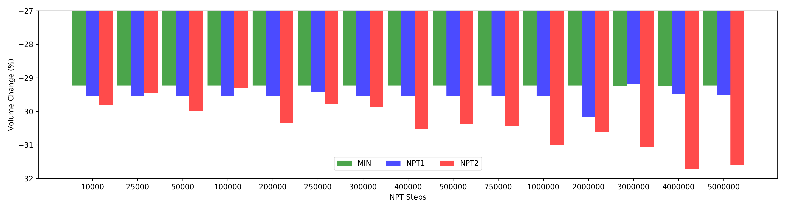
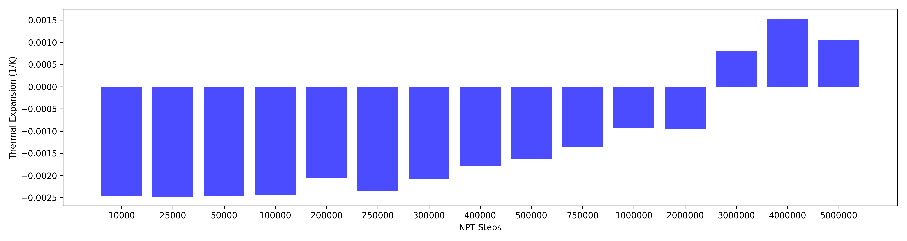
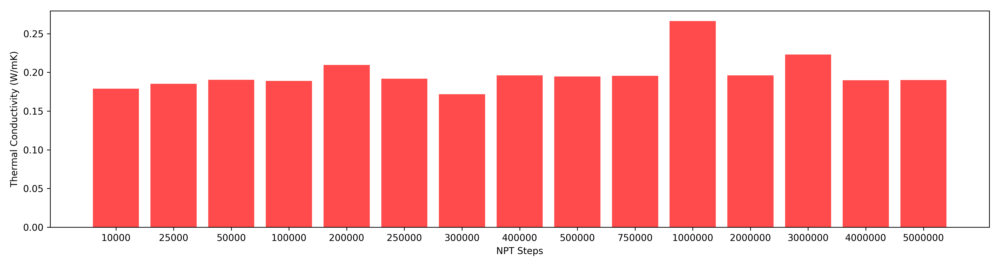

Screening Tests
===============
Initial tests to identify optimum procedure for large scale screening of CoRE database.

Thermal Conductivity
--------------------
For most MOFs there is no apparent effect of procedure on thermal conductivity. However, for some MOFs (especially when the force field does not represent the structure well) the initial geometry can be different than final geometry which effects phonon scattering rates and consequently thermal conductivity. This can be seen in MOF-200 by looking at [heat flux autocorrelation functions](#heat-flux-autocorrelation).

  

Volume change
-------------
Volume change can be a result of force field minimization as well as thermal expansion. It significantly effects structure geometry and consequently thermal transport. Here I have tried using only minimization (*MIN*), only NPT (*NPT*) and both (*MIN+NPT*) to see how they affect the final volume of the structure. For most cases, the volume change is similar between three procedures, however for some MOFs high thermal expansion is observed (LKLIN, BAZGAM, KOTSIX, ABEXIQ). This might even result in minimization shrinking the volume and NPT increasing the volume compared to initial geometry or vice versa.

  

Wall time
---------
As expedcted, wall time increases with number of atoms, and the procedure with most time steps (*MIN+NPT*) is the most expensive. For irregularities (e.g. MOF-200, KOTSIX) I believe the cluster network communication is to blame.

  

Computational Resource
----------------------
### Wall time

  

### Thermal conductivity

  

### Volume change

  

Number of steps
----------------------

### Volume change

  

### Wall time

  

### Thermal conductivity

  

Heat flux autocorrelation
-------------------------
### Procedure 0 (NVT | NVE)

  

### Procedure 1 (NPT | NVT | NVE)

  

### Procedure 2 (MIN | NVT | NVE)

  

### Procedure 3 (MIN  | NPT | NVT | NVE)

  

Thermal expansion
-----------------

I have looked into calculating thermal expansion from the volume and enthalpy fluctuations during an NPT simulation. [Here](https://kbsezginel.github.io/thermof/thermal_expansion) is more information on the calculation.

### Volume change (YASLUA)
Before recording enthalpy and volume I ran minimization (*MIN*) and an equilibration NPT (*NPT1*). Then by changing the number of steps for production NPT (*NPT2*) we can see the volume change does not reqlly converge that easily.

  

**Volume vs time during *NPT2***

  

### Thermal expansion (YASLUA)
The convergence is also an issue here as it seems like after 3x106 timesteps we start observing positive thermal expansion? Moreover, the thermal expansion values seen here are orders of magnitude larger than what is typically observed for MOFs (1x10-5 1/K).

  

### Thermal conductivity (YASLUA)

  

Tables
------

### Thermal conductivity

| MOFs     |   k (W/mK) - P0 |   k (W/mK) - P1 |   k (W/mK) - P2 |
|:---------|----------------:|----------------:|----------------:|
| YASLUA   |        0.136772 |       0.21259   |        0.194549 |
| TIVFAG   |        1.05043  |       0.84558   |        0.989194 |
| KOTSIX   |        0.695291 |       0.663363  |        0.707111 |
| BAZGAM   |        0.259037 |       0.16443   |        0.265532 |
| KAVLID   |        1.97645  |       1.82541   |        1.71133  |
| UIO-66   |        0.868001 |       0.868322  |        0.869356 |
| MOF-200  |        0.280038 |      -0.0720143 |        0.529195 |
| MIBQAR01 |        0.67421  |       0.520306  |        0.558647 |
| ABEXIQ   |        0.798137 |       0.753924  |        0.617633 |
| IRMOF-1  |        0.624206 |       0.534997  |        0.462318 |
| LUKLIN   |        0.334687 |       0.287491  |        0.402686 |

### Volume change

| MOFs     |   dV (%) - P0 |   dV (%) - P1 |   dV (%) - P2 |
|:---------|--------------:|--------------:|--------------:|
| YASLUA   |             0 |       -29.935 |       -29.276 |
| TIVFAG   |             0 |        -4.113 |        -3.811 |
| KOTSIX   |             0 |         0.961 |        -2.498 |
| BAZGAM   |             0 |        -2.753 |         0.673 |
| KAVLID   |             0 |        -4.026 |        -4.562 |
| UIO-66   |             0 |        -5.67  |        -5.437 |
| MOF-200  |             0 |       -20.028 |       -18.876 |
| MIBQAR01 |             0 |        -8.419 |        -7.541 |
| ABEXIQ   |             0 |       -22.139 |       -17.819 |
| IRMOF-1  |             0 |        -7.666 |        -6.993 |
| LUKLIN   |             0 |       -11.695 |         0.815 |

### Wall time

| MOFs     |   N atoms |   Time (mins) - P0 |   Time (mins) - P1 |   Time (mins) - P2 |
|:---------|----------:|-------------------:|-------------------:|-------------------:|
| YASLUA   |      2400 |            39.1833 |            61.6    |             76.05  |
| TIVFAG   |      2576 |           139.367  |           176.45   |            169.283 |
| KOTSIX   |      2862 |           147.933  |           329.667  |            181.183 |
| BAZGAM   |      3392 |            24.1333 |            29.0167 |             36.35  |
| KAVLID   |      5088 |           167.583  |           207.617  |            181.433 |
| UIO-66   |      6272 |            92.4667 |           114.95   |            104.117 |
| MOF-200  |     10800 |           177.167  |           185.983  |            395.767 |
| MIBQAR01 |     11664 |            29.5167 |            40.5333 |             30.75  |
| ABEXIQ   |     11800 |            97.7167 |           140.7    |            123.767 |
| IRMOF-1  |     13568 |            27      |            33.4667 |             28.95  |
| LUKLIN   |     14400 |            26.0333 |            31.3667 |             27.05  |
