Thermal Conductivity
--------------------

 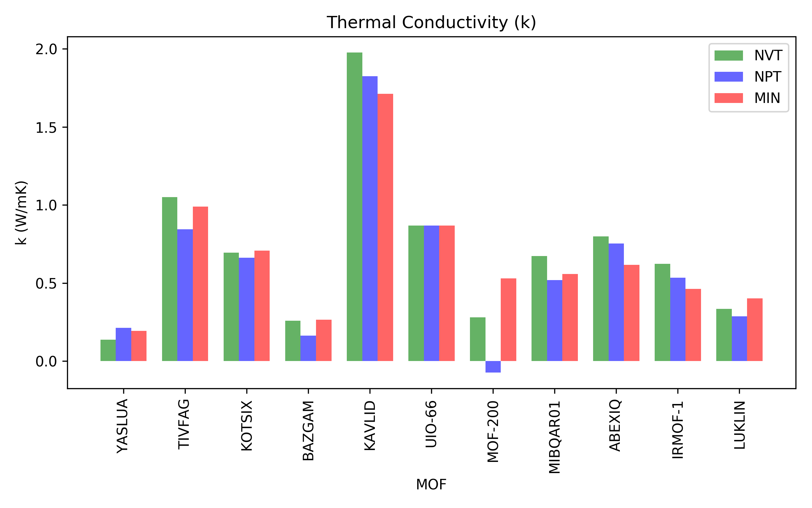 

| MOFs     |   k (W/mK) - P0 |   k (W/mK) - P1 |   k (W/mK) - P2 |
|:---------|----------------:|----------------:|----------------:|
| YASLUA   |        0.136772 |       0.21259   |        0.194549 |
| TIVFAG   |        1.05043  |       0.84558   |        0.989194 |
| KOTSIX   |        0.695291 |       0.663363  |        0.707111 |
| BAZGAM   |        0.259037 |       0.16443   |        0.265532 |
| KAVLID   |        1.97645  |       1.82541   |        1.71133  |
| UIO-66   |        0.868001 |       0.868322  |        0.869356 |
| MOF-200  |        0.280038 |      -0.0720143 |        0.529195 |
| MIBQAR01 |        0.67421  |       0.520306  |        0.558647 |
| ABEXIQ   |        0.798137 |       0.753924  |        0.617633 |
| IRMOF-1  |        0.624206 |       0.534997  |        0.462318 |
| LUKLIN   |        0.334687 |       0.287491  |        0.402686 |

Volume change
-------------

 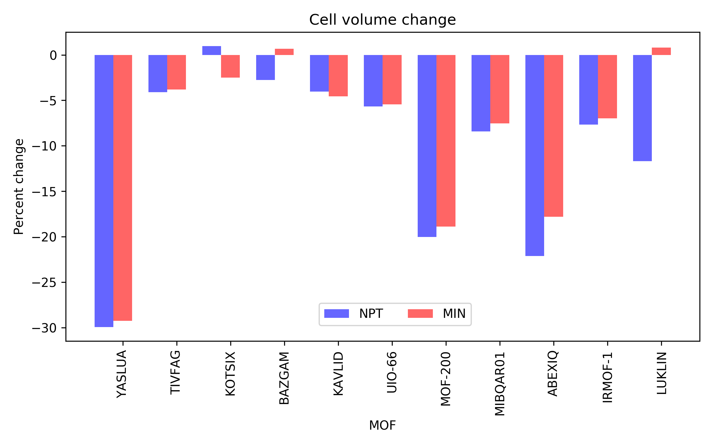 

| MOFs     |   dV (%) - P0 |   dV (%) - P1 |   dV (%) - P2 |
|:---------|--------------:|--------------:|--------------:|
| YASLUA   |             0 |       -29.935 |       -29.276 |
| TIVFAG   |             0 |        -4.113 |        -3.811 |
| KOTSIX   |             0 |         0.961 |        -2.498 |
| BAZGAM   |             0 |        -2.753 |         0.673 |
| KAVLID   |             0 |        -4.026 |        -4.562 |
| UIO-66   |             0 |        -5.67  |        -5.437 |
| MOF-200  |             0 |       -20.028 |       -18.876 |
| MIBQAR01 |             0 |        -8.419 |        -7.541 |
| ABEXIQ   |             0 |       -22.139 |       -17.819 |
| IRMOF-1  |             0 |        -7.666 |        -6.993 |
| LUKLIN   |             0 |       -11.695 |         0.815 |

Wall time
---------

 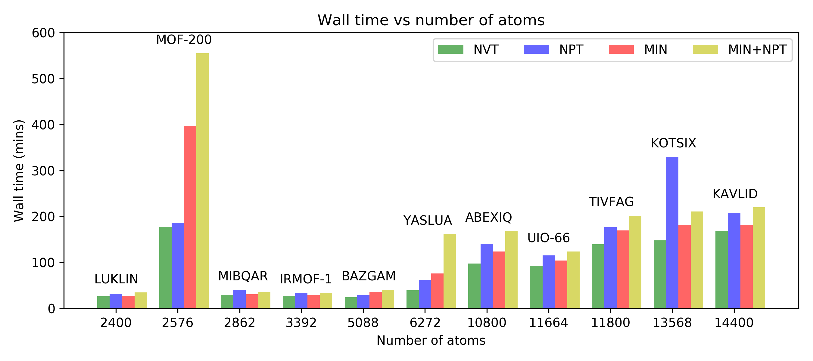 

| MOFs     |   N atoms |   Time (mins) - P0 |   Time (mins) - P1 |   Time (mins) - P2 |
|:---------|----------:|-------------------:|-------------------:|-------------------:|
| YASLUA   |      2400 |            39.1833 |            61.6    |             76.05  |
| TIVFAG   |      2576 |           139.367  |           176.45   |            169.283 |
| KOTSIX   |      2862 |           147.933  |           329.667  |            181.183 |
| BAZGAM   |      3392 |            24.1333 |            29.0167 |             36.35  |
| KAVLID   |      5088 |           167.583  |           207.617  |            181.433 |
| UIO-66   |      6272 |            92.4667 |           114.95   |            104.117 |
| MOF-200  |     10800 |           177.167  |           185.983  |            395.767 |
| MIBQAR01 |     11664 |            29.5167 |            40.5333 |             30.75  |
| ABEXIQ   |     11800 |            97.7167 |           140.7    |            123.767 |
| IRMOF-1  |     13568 |            27      |            33.4667 |             28.95  |
| LUKLIN   |     14400 |            26.0333 |            31.3667 |             27.05  |

Computational Resource
----------------------
### Wall time

 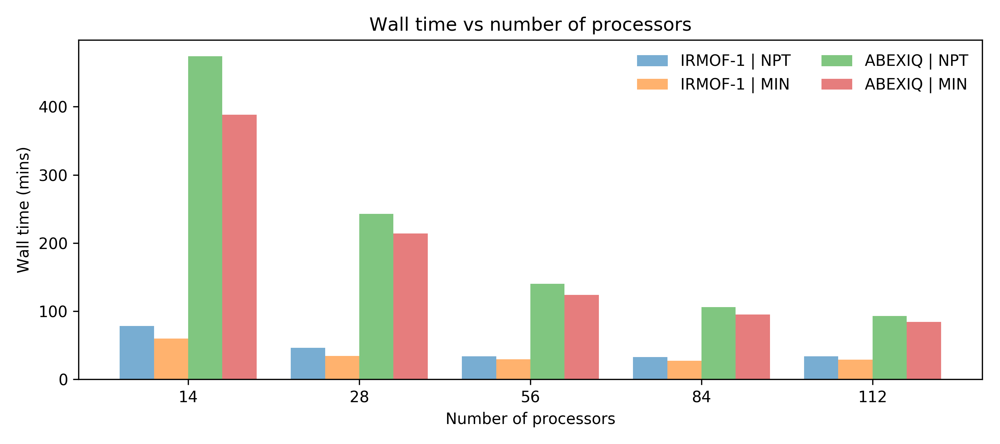 

### Thermal conductivity

 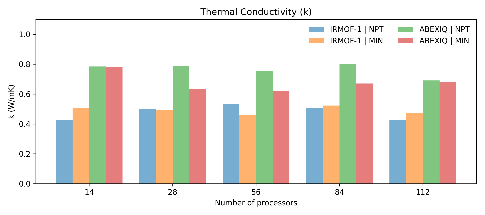 

### Volume change

 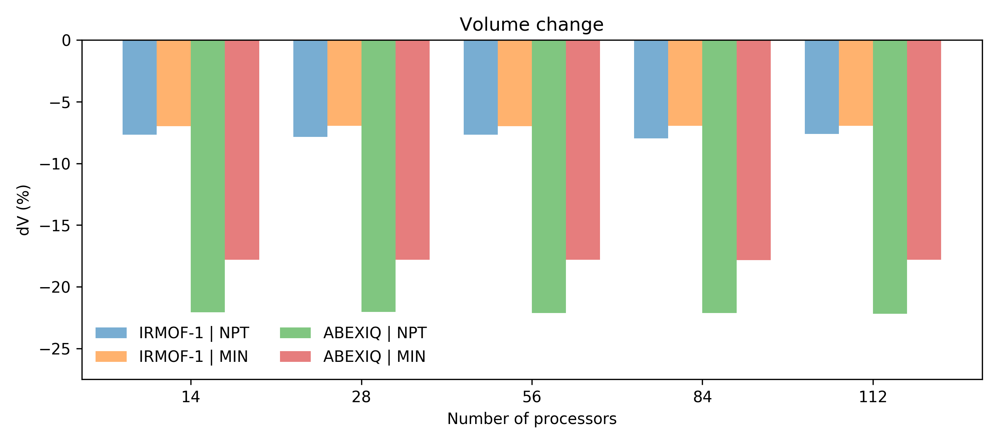 

| MOF     | Procedure   |   Nodes |   PPN |   Time (min) |   k (W/mK) |    dV (%) |
|:--------|:------------|--------:|------:|-------------:|-----------:|----------:|
| ABEXIQ  | MIN         |       2 |     7 |     388.217  |   0.781531 | -17.8189  |
| ABEXIQ  | MIN         |       2 |    14 |     214.05   |   0.630812 | -17.8197  |
| ABEXIQ  | MIN         |       2 |    28 |     123.75   |   0.617633 | -17.8195  |
| ABEXIQ  | MIN         |       3 |    28 |      95.2833 |   0.671034 | -17.8261  |
| ABEXIQ  | MIN         |       4 |    28 |      84.2833 |   0.679378 | -17.819   |
| ABEXIQ  | NPT         |       2 |     7 |     474.217  |   0.78426  | -22.08    |
| ABEXIQ  | NPT         |       2 |    14 |     242.867  |   0.78819  | -22.0426  |
| ABEXIQ  | NPT         |       2 |    28 |     140.067  |   0.753924 | -22.1385  |
| ABEXIQ  | NPT         |       3 |    28 |     106.183  |   0.801959 | -22.1161  |
| ABEXIQ  | NPT         |       4 |    28 |      92.8333 |   0.690596 | -22.1984  |
| IRMOF-1 | MIN         |       2 |     7 |      60.0333 |   0.503362 |  -6.97436 |
| IRMOF-1 | MIN         |       2 |    14 |      34.45   |   0.494974 |  -6.96926 |
| IRMOF-1 | MIN         |       2 |    28 |      29.2833 |   0.462318 |  -6.99281 |
| IRMOF-1 | MIN         |       3 |    28 |      27.0667 |   0.523496 |  -6.96839 |
| IRMOF-1 | MIN         |       4 |    28 |      28.8833 |   0.472063 |  -6.97095 |
| IRMOF-1 | NPT         |       2 |     7 |      78.1833 |   0.426634 |  -7.67816 |
| IRMOF-1 | NPT         |       2 |    14 |      46.1667 |   0.499285 |  -7.855   |
| IRMOF-1 | NPT         |       2 |    28 |      33.6833 |   0.534997 |  -7.66637 |
| IRMOF-1 | NPT         |       3 |    28 |      32.4167 |   0.508687 |  -7.96882 |
| IRMOF-1 | NPT         |       4 |    28 |      33.6833 |   0.42761  |  -7.62663 |

Number of steps
----------------------

### Volume change

 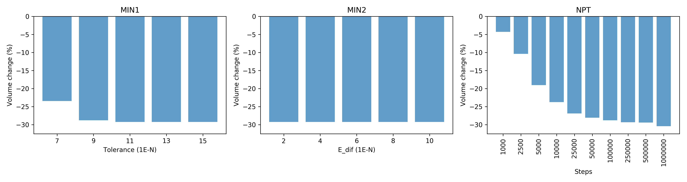 

### Wall time

 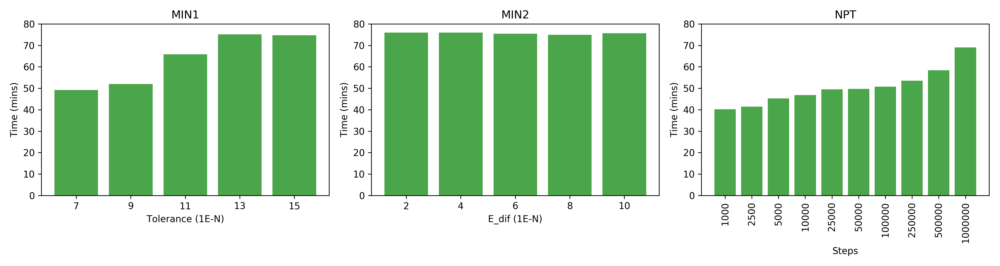 

### Thermal conductivity

  

Heat flux autocorrelation
-------------------------
### Procedure 0 (NVT | NVE)

 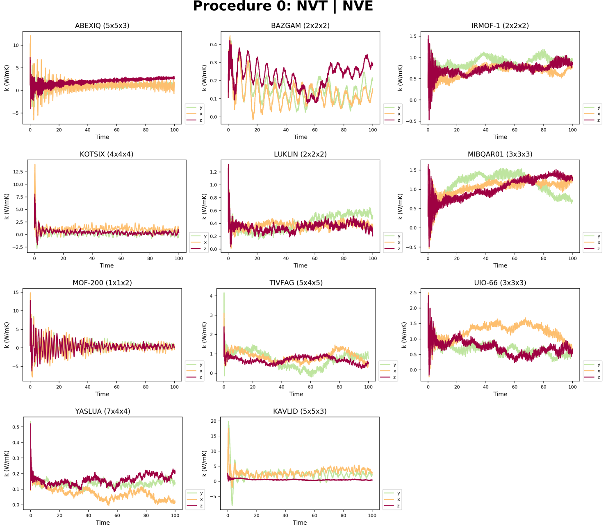 

### Procedure 1 (NPT | NVT | NVE)

 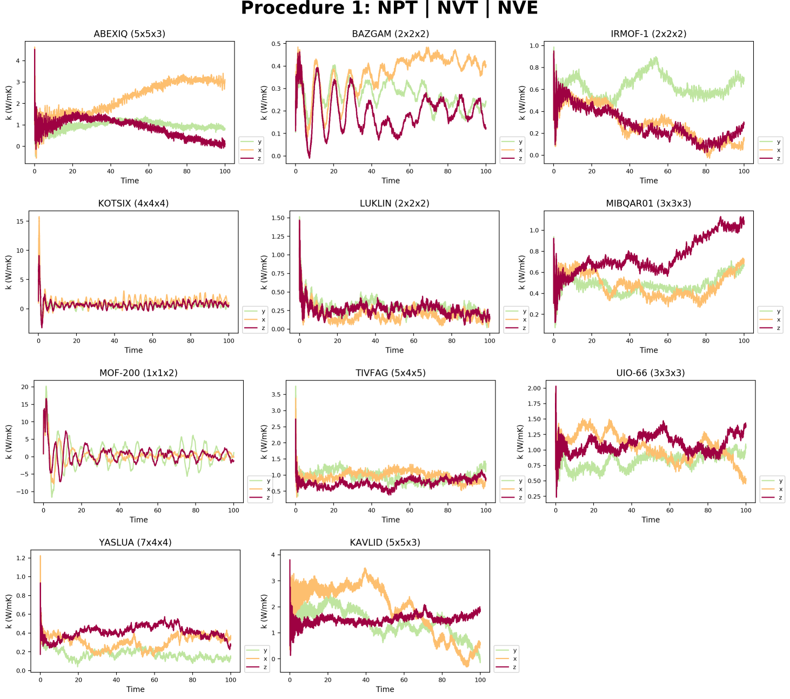 

### Procedure 2 (MIN | NVT | NVE)

 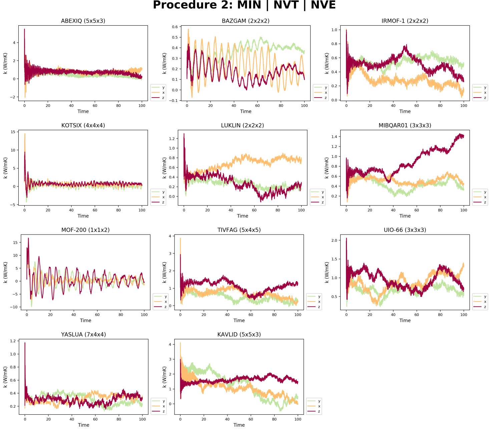 

### Procedure 3 (MIN  | NPT | NVT | NVE)

 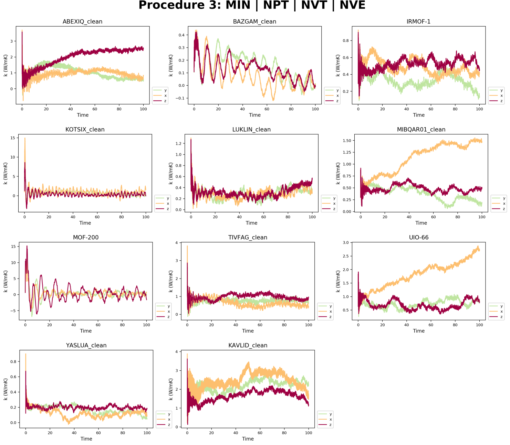 

