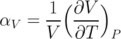
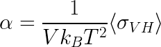
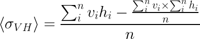
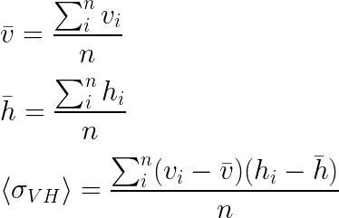

Thermal expansion is the tendency of matter to change in shape, area, and volume in response to a change in temperature.<sup>[1][1]</sup>
In the general case of a gas, liquid, or solid, the volumetric coefficient of thermal expansion is given by

<p align="center"></p>

The thermal expansion coefficient is based on the [covariance](https://en.wikipedia.org/wiki/Covariance) of volume and enthalpy of the system.
We can calculate thermal expansion in NPT ensemble using the relation below: <sup>[2][2], [3][3]</sup>

<p align="center"></p>


The covariance of volume and enthalpy can then be calculated by collecting enthalpy and volume data during the NPT run.

### Naive algorithm

Covariance can be calculated using the naive algorithm with the relation below: <sup>[4](https://en.wikipedia.org/wiki/Algorithms_for_calculating_variance#Covariance)</sup>

<p align="center"></p>

Here is an example Python implementation:

```python
def naive_covariance(data1, data2):
    n = len(data1)
    sum1 = sum(data1)
    sum2 = sum(data2)

    sum12 = 0
    for d1, d2 in zip(data1, data2):
        sum12 += d1 * d2

  covariance = (sum12 - sum1 * sum2 / n) / n
  return covariance
```

### Two pass algorithm

Covariance can be calculated using the two pass algorithm with the relation below: <sup>[4](https://en.wikipedia.org/wiki/Algorithms_for_calculating_variance#Covariance)</sup>

<p align="center"></p>

Here is an example Python implementation:

```python
def two_pass_covariance(data1, data2):
    n = len(data1)
    mean1 = sum(data1) / n
    mean2 = sum(data2) / n

    covariance = 0
    for i1, i2 in zip(data1, data2):
        a = i1 - mean1
        b = i2 - mean2
        covariance += a * b / n
    return covariance
```

#### Lammps

Using `real` units in Lammps `enthalpy` is reported in `kcal/mol` and volume is reported in `ų`. Using Boltzmann constant as `0.0019872041 kcal/mol.K` we can calculate thermal expansion in `1/K` units.


#### Sources

[1]: (https://en.wikipedia.org/wiki/Thermal_expansion)

[2]: (http://pubs.acs.org/doi/pdf/10.1021/ct200731v)

[3]: (http://utkstair.org/clausius/docs/mse614/pdf/thermo_intro_v01.pdf)

[4]: (https://en.wikipedia.org/wiki/Algorithms_for_calculating_variance#Covariance)
